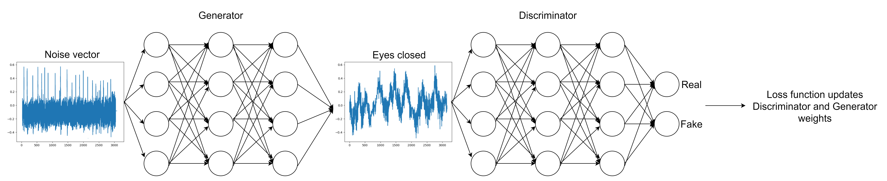
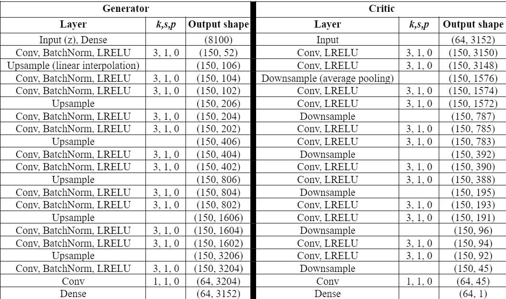
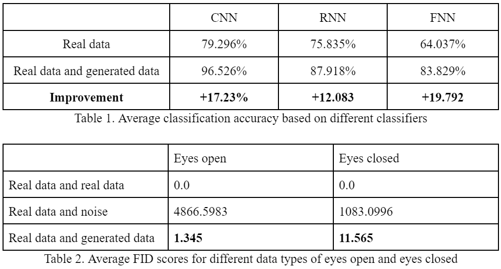
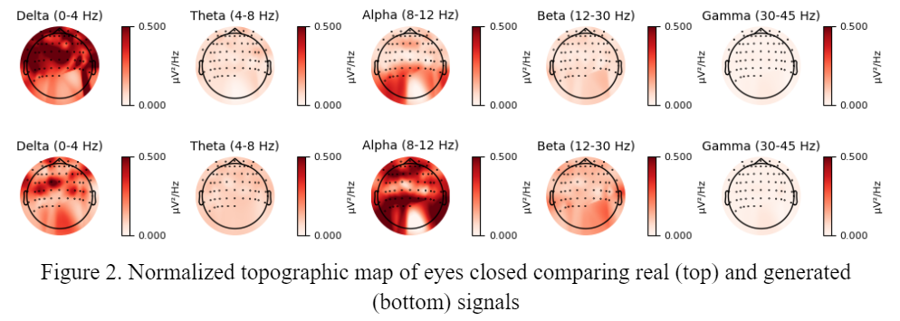
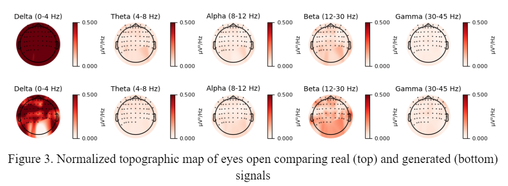
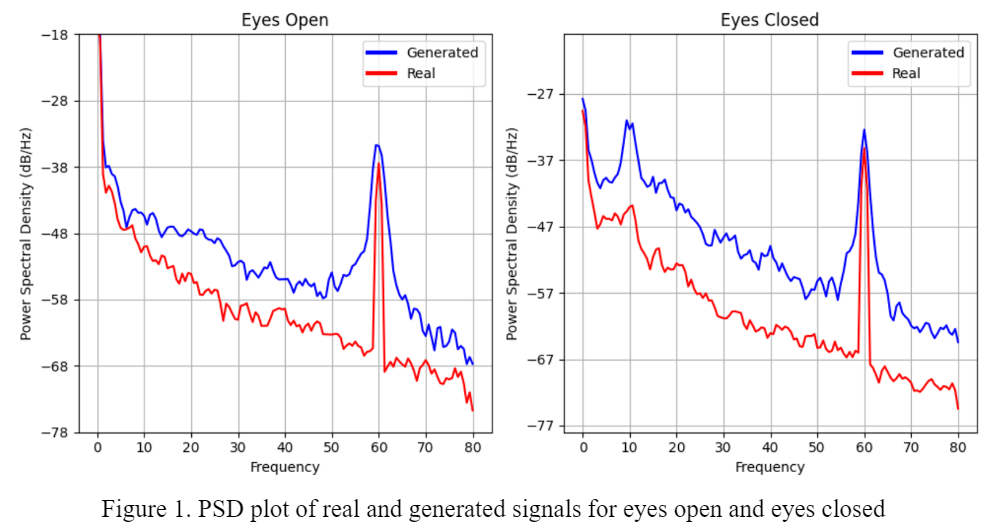

# Improving EEG Signal Availability using Deep Learning and Generative Adversarial Networks

<p align="center">
  
</p>

[](https://opensource.org/licenses/MIT)

## Project Description
This repository contains the implementation of the Wasserstein GAN (WGAN) model with gradient penalty developed in our [research paper](). The focus of our research was to generate synthetic 1-D time-series Electroencephalogram (EEG) signals that mimic real EEG data.

The implemented WGAN-GP model takes as input a tensor of shape (batch size, 64, 3152). Here, '64' corresponds to the 64 channels of the EEG, and '3152' is the sequence length of the time-series for each channel. After generating synthetic EEG data, we assess the quality of these generated signals by using the classification accuracy of three classifiers: Fully Connected Neural Network (FNN), Convolutional Neural Network (CNN), and Recurrent Neural Network (RNN). 

Model architecture:
<p align="center">
  
</p>


## Requirements
Install the necessary libraries by running:

```
pip install -r requirements.txt
```

## Quick Start
To train the model and reproduce the results from our paper, simply run wgan-gp.ipynb file in a notebook environment such as Jupyter notebook

## Results
Detailed results and comparisons are available in our paper.

<p align="center">
  
</p>

<p align="center">
  
  
</p>

<p align="center">
  
</p>

## Citation
If you find our work useful, please cite our paper: [Improving EEG Signal Availability using Deep Learning and Generative Adversarial Networks]():

## Contact
Feel free to contact joshparksj(at)gmail(dot)com for any question or suggestion.
